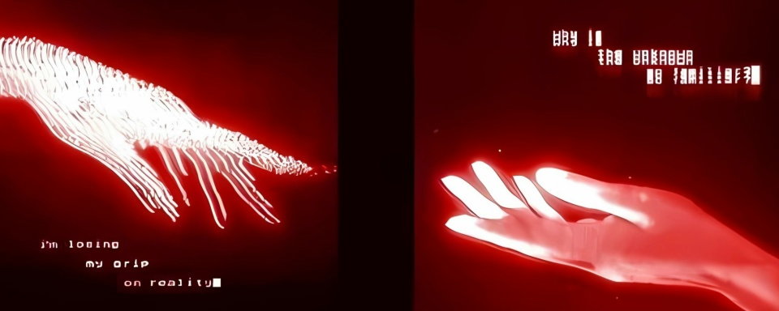

  

<h1 align="center">Привет! Я — Lenorio 👋</h1>

  <strong>Full-stack разработчик (JS / C++ / C#)</strong>

  

  
  
  

---

### 🛠 Стек технологий

  
  
  

---

### 🚀 Активный проект
#### [gemini-cli-wrapper](https://github.com/lenorio/gemini-cli-wrapper)
> Удобная обертка для работы с Google Gemini через командную строку.

  

---

### 📊 Статистика профиля

  
  

